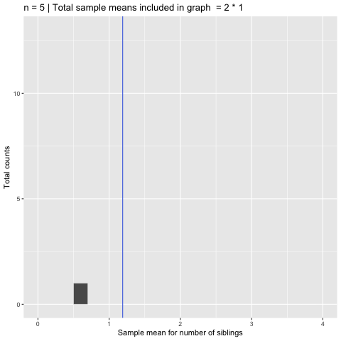
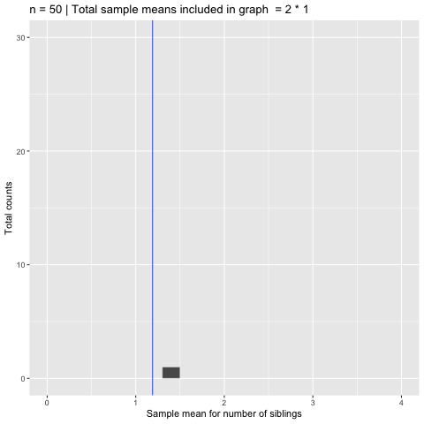
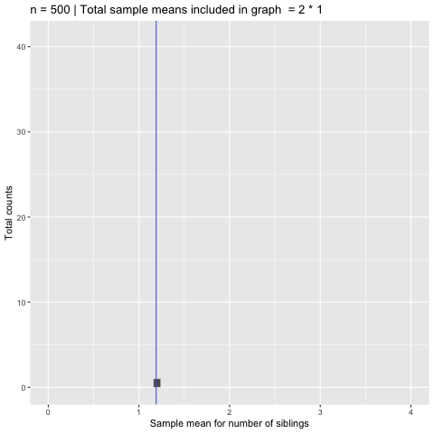

This is my $P(X \geq 109)$.

## Getting population parameters

First, we load in libraries as normal.
```{r, message=FALSE}
library(ggplot2)
library(dplyr)
library(readr)
library(knitr)
```

Let's check out the census data we have on Alameda.
```{r}
alameda <- read.csv("../data/alameda.csv")
head(alameda)
```

Notice how right-skewed the following true distribution is.

```{r, out.width="75%"}
# * CALCULATE TRUE MEAN SIBS
mean_sibs <- alameda %>% summarize(mean_sibs=mean(num_sibs)) %>% pull(mean_sibs)

# * VISUALIZE TRUE DISTRIBUTION OF MEAN NUMBER OF SIBLINGS
ggplot(data=alameda, aes(x=num_sibs)) +
  geom_bar(col="white", lwd=0.2) + 
  geom_vline(xintercept=mean_sibs, col="royalblue") +
  ggtitle("True distribution of number of siblings")
```

Now, we're going to make **sampling distributions**. Do not confuse these with distributions of samples! We are taking a **statistic of a sample** then plotting it on a histogram! We are not taking a sample, then making a histogram of the sample! The shapes would be entirely different.

## Calculating sample statistics
To get a sample of size 5 from the Alameda data, we use `sample_n()`.
```{r}
sample_5 <- alameda %>% sample_n(5)
sample_5
```

Then, we take the sample statistic of the mean number of siblings. This value may not properly reflect the true population mean number of siblings which is 1.18 siblings, as per above.

```{r}
sample_5 %>% summarize(mean_sibs=mean(num_sibs))
```

Now, we're going to show you how if we take many many samples of size $n={5, 50, 500}$ how our sampling distribution of the sample mean $\bar{X}_n$ would change. We will be taking a total of 100 samples for each of the sample sizes. As you look at the following GIF's (is it jiff or ghiff? :P), think about the following questions:

  1. How does the variance change when we increase the sample size?
  2. How does the distributional shape change when the number of samples increases?
  3. How does the distributional shape change when we increase the sample size?

### Sampling distribution with n=5
Check out the animation for $n=5$. Notice that we have quite the spread/variance, and our estimates aren't so awesome, but the overall mean looks like it is close to the true mean number of siblings which is 1.18.

```{r, out.width="75%", echo=FALSE}

```

### Sampling distribution with n=50
The animation for $n=50$ looks like this.  
```{r, out.width="75%", echo=FALSE}

```

### Sampling distribution with n=500
The animation for $n=500$ looks like this.  

```{r, out.width="75%", echo=FALSE}

```

To have a clearer look at the normal distribution, we can make the binwidth smaller.

```{r, out.width="75%", echo=FALSE}

```