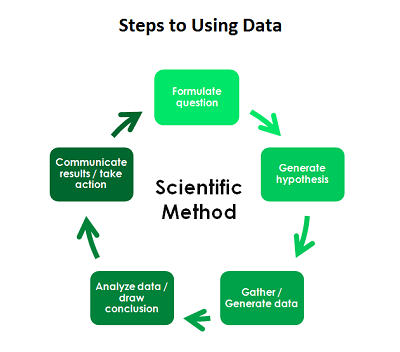

# Announcements
1. This is not up anywhere because we're going to write it as we go...  
2. Sign in online: Lab 108, Lab 101
3. Midterm...

# P-Hacking
**Reference**:  
https://freakonometrics.hypotheses.org/19817
http://www.dataversity.net/applying-the-scientific-method-to-data-science/

**What is p-value?** It is the probability of rejecting your null hypothesis given that it is true. When someone sets their $\alpha$ significance level to $0.05$, then we're saying that if the data are observed 5% or more of the time, then they are not significant.

**Science is built upon this fantasy of p-value < 0.05.** For publications, you need to show that you work is significant. But remember, this is supposed to be through the scientific method. Take a look at the scientific method. Take note of where gathering data and generating your hypotheses are positioned.

```{r, out.width=700}

```

**Getting a p-value below 0.05 does not always mean your observations were significant.** Surely, you could start anywhere in this cycle, then take three cycles, and you might come out with some significant results. It sucks to realize, but some "scientists" don't follow this clockwise turn.

Here are two problems that constitute to getting invalid p-values below 0.05.  
**People don't know stats.**  
    a. Using the wrong statistical method  
    b. Not correcting for multiple testing  
    c. Not checking your code for consistency/accuracy  
**People abuse stats.**   
    a. Collecting data until the p-value is less than 0.05, then stop   
    b. Keep sampling until you find one sample that will give you that 0.05  

**Why?** Tenure? Fame? Money? Passion? Ignorance? Things like that. The take home idea is that you have to use statistics the right ways to produce valid results. When you make your science all about making your p-value less than 0.05, then you have an awful view of science.

**We have ways to keep this from happening.** You may often hear about "reproducible research". Some researchers make livings off of trying to reproduce studies, then proving them wrong. For those of you who love showing others they are wrong, ... time for a career change?


# Our Hypotheses
Your hypotheses remain the same. Is my average truly some value, given that I collected the data I did? The way you test your hypotheses changes according to what is given to you.  

You have tools under your belt now.

(1) You learned distributions to understand *data have shapes*. These are shapes that are not constrained to any certain setting or type of problem. Your normal distribution is a shape, like a circle, a square. Data can look normal, and this may help in simulation, in testing assumptions, and in estimating probabilities.

(2) You learned about $(1-\alpha)100%$ confidence intervals which correspond to tests at the significance level $\alpha$.  

(3) You learned about a z-test where you data with that is assumed to be normally distributed with known population $\sigma$ and unknown $\mu$.  

But when do you even know $\sigma$?

**Note:** In this class, we are more careful than just setting an $\alpha$ significance level. We will look at p-values closely and interpret them according to any reasonable signficance level.

Notice where the equality is at. On a curve, where do we see the p-values visually?

$$
\begin{aligned}
H_0: \mu &= 0  \\
H_1: \mu &\neq 0
\end{aligned}
$$

$$
\begin{aligned}
H_0: \mu & \geq 0  \\
H_1: \mu &< 0
\end{aligned}
$$


# The Normal and t-Distributions
**Reference:**  
https://www.statmethods.net/advgraphs/probability.html  


What are the differences though, really?
**References:**  
https://keydifferences.com/difference-between-t-test-and-z-test.html  
http://sphweb.bumc.bu.edu/otlt/MPH-Modules/QuantCore/QuantCore9-RelatingExp-and-Outcomes/QuantCore9-RelatingExp-and-Outcomes2.html
https://stats.stackexchange.com/questions/85804/choosing-between-z-test-and-t-test

"you simply always use the t-test if you don't know the population standard deviation a-priori"

## Normal Distribution
**Reference:**  
https://onlinecourses.science.psu.edu/stat414/node/269/
http://www.stat.wvu.edu/SRS/Modules/Normal/normal.html

Carl Gauss? 1809. DeMoivre derived it in 1733. But names for the normal distribution?


Normally distributed. Mean of 100, standard deviation of 15. Test for $H_0: \mu=100$ v $H_1: \mu \neq 100$ based on a new observation of 42. You looked at 12 observations total.

What kind of test do you use?
What's the p-value?
How would this change if the hypotheses were different?

```{r}
mean=100; sd=15
lb=80; ub=120

x <- seq(-4,4,length=100)*sd + mean
hx <- dnorm(x, mean, sd)

plot(x, hx, type="n", xlab="IQ Values", ylab="",
  main="N(100, 15)", axes=FALSE)

i <- x >= lb & x <= ub
lines(x, hx)
axis(1, at=seq(40, 160, 20), pos=0)
```

What is the z-statistic?
$$
z = \frac{x-\mu_0}{\sigma/\sqrt{n}}
$$

```{r}
mu <- 100
z  <- (42 - mu) / (15/12)
z
```


## Student t-Distribution
**References:**
http://statweb.stanford.edu/~naras/jsm/TDensity/TDensity.html
https://datascienceplus.com/t-tests/
http://docs.statwing.com/examples-and-definitions/t-test/  
https://blog.minitab.com/blog/statistics-and-quality-data-analysis/what-are-degrees-of-freedom-in-statistics  

1908. Student was William E. Gosett's pen name.

```{r}
x <- seq(-4, 4, length=100)
hx <- dnorm(x)

epsilon <- rep(runif(50, 0, 0.1), each=2)
our_data <- dt(x,1)+epsilon
```


Imagine we have these data. I want to test if our data has the mean of 0. So, my hypotheses are

$$
\begin{aligned}
H_0: \mu &= 0  \\
H_1: \mu &\neq 0
\end{aligned}
$$

```{r}
hist(our_data)
```

We can try a qq-plot.

```{r}
qqnorm(our_data)
```


Grey is normal, blue is df=1, and the orange red is our data. Our data are bell shaped. Our sample size is big. We're going to do a t-test instead of a z-test because we don't know our population parameters anyway.

```{r}
plot(x, hx, type="l", lwd=3, lty=3, xlab="x value",
  ylab="Density", main="t-Distribution, df=99", col="black")

lines(x, our_data, lwd=3, col=adjustcolor("orangered", alpha.f = 0.7), type="b")
lines(x, dt(x, 99), lwd=3, col=adjustcolor("blue", alpha.f=0.3), type="l")
```

What is the t-statistic?
$$
t = \frac{\bar x-\mu}{s/\sqrt{n}}
$$

How does this differ from the z-statistic?

```{r}
t <- (mean(our_data)-0) / (sd(our_data)/sqrt(100))
t
```


Check out what our degrees of freedom are calculated to be.

```{r}
t.test(our_data, mu=0, paired=FALSE)
```

# Degees of Freedom
**Reference:**
https://www.youtube.com/watch?v=Cm0vFoGVMB8  
https://www.youtube.com/watch?v=rATNoxKg1yA  (pay close attention at 7 minutes)
https://stats.stackexchange.com/questions/110359/why-does-the-t-distribution-become-more-normal-as-sample-size-increases


```{r}
x <- seq(-4, 4, length=100)
hx <- dnorm(x)

degf <- c(1, 3, 8, 30)
colors <- c("red", "blue", "darkgreen", "gold", "black")
labels <- c("df=1", "df=3", "df=8", "df=30", "normal")

plot(x, hx, type="l", lty=2, xlab="x value",
  ylab="Density", main="Comparison of t Distributions")

for (i in 1:4){
  lines(x, dt(x,degf[i]), lwd=2, col=colors[i])
}

legend("topright", inset=.05, title="Distributions",
  labels, lwd=2, lty=c(1, 1, 1, 1, 2), col=colors)
```

# Exam Practice
**Reference:** Barron's AP statistics.

**Example**  
A random sample of high schoolers in a class is taught to do a dance, and they were graded by a council of judges on a scale from 1-10 on their technique. After several weeks of rehearsing the dance, the high schoolers were judged again on the same scale for their technique. This data should be analyzed using a:  

(a) z-test of proportions  
(b) a two-sample t-test of means  
(c) a paired t-test  


**Example**  
You have been told that your backpack is super heavy! There being no authority on how heavy everyone's backpacks are, you have no choice but to investigate how heavy your backpack is based on a sample. You have these data.  

```{r}
weight_in_lbs <- c(6, 7, 10, 2, 2, 2.3, 5, 4, 9, 1, 3, 3.5, 4, 10, 11, 4, 5, 5, 5.6, 6, 7, 11, 4, 5.6, 7, 7.8, 1.6, 2.7, 2, 2.5, 6, 3, 3, 3, 3.9)
hist(weight_in_lbs)
```

You also have that the sample size, mean, and standard deviation are:
```{r}
c(n=length(weight_in_lbs), mean=mean(weight_in_lbs), sd=sd(weight_in_lbs))
```

Your backpack is 14 lbs. How would you statistically react?

# Do the lab
What test would we use? Why? (Even though you can infer from class...)  
Why would you use a paired t-test? What does it control for?  

# For Home
https://sites.psu.edu/stat200psbsp2013/2013/03/19/one-sample-z-test-problems-with-solutions/
http://ocw.umb.edu/psychology/psych-270/extra/Extra_Problems_t-tests_full.pdf


