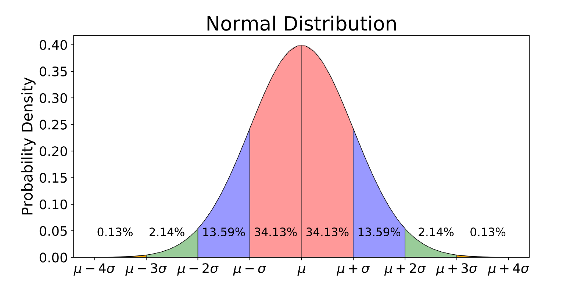

<b>Note to fellow GSI's</b>: Some of this does not need to be read aloud, but rather just as some extra conceptual material for students to read on their own.

<b>Note to students</b>: Please also consult lecture notes and your text. Good luck studying to all!

## Study Design

### Chapter 6
Chapter 6 has to do with the main idea of how to get the best estimates of your population with a sample.


#### Population vs. Sample
- **Population**: The entire group of individuals about which we want information.
- **Sample**: The part of the population for which we actually collect information. We use a sample to draw conclusions about the entire population.
- **External validity/representativeness**: Does the sample represent the population? 
Comes from your sampling design

#### Observational vs. Experimental
**NOTE**: The textbook states experiments are the only way to assess cause-and-effect, but we argue that observational studies can also be used to assess this

- **Observational**: observes individuals and measures variables of interest but does not attempt to influence the responses
- **Experimental**: deliberately imposes some treatment on individuals in order to observe their responses


#### Lurking/Confounding variables
- The association between an exposure and an outcome is **confounded** if there exist
one or more variables that are causes of the outcome that are also associated 
with the exposure of interest
- Only important if you want to estimate if some factor causes some outcome (no confounders in predictive or descriptive)

#### Study Design
1. **Who** belongs to the target population?
2. **How** you will take a sample of the target population?
3. What **variables** you will measure? What are the levels of each variable? How will you measure these variables?
    

#### Inference
The process of drawing conclusions about a population based on a sample


#### Bias
When the expected value based on a sample differs from the true underlying parameter value. 


#### Good versus Bad Designs
What factors contribute to good vs. bad study designs?

- **Who** is being sampled?
- **How** is the sampling being conducted?
- Are the individuals chosen randomly or with some other manner? For what purpose?


#### Some types of samples to consider
**NOTE**: not all of these are necessarily "good" samples (look to textbook/lecture notes for pros/cons)

- Simple random sample
- Multistage sampling
- Proportion stratified sample
- Disproportion stratified sample
- Sample surveys
- Cohort studies

### Chapter 7

## Probability

### Chapter 9

### Chapter 10

## Distributions
A common question has been <i><b>WHEN DO WE USE THESE DISTRIBUTIONS!?</i></b> Well, sometimes our data tell a story that we see over and over again.

We can think of distributions as things that model patterns in data. If we see data that looks approximately normal or follows a recipe for the Binomial or Poisson(*), then we should definitely consider using the appropriate distribution. When we use a distribution like one of the named three above, we can end up saying a lot about our data. We can say the mean, the variance/standard deviation, and calculate probabilities.

(*) See the following Chapter 11 and 12 notes for these recipes.

### Chapter 11: Normal Distribution
```{r, echo=FALSE, fig.cap="The empirical rule for the Normal Distribution", out.width = '100%'}

```

<u>Recipe for Normal</u>  
This isn't quite a recipe, but more like guidelines.
<ol>
  <li>Goals: We want to find a probability, i.e. $P(X>k), P(X<k), P(X \geq K), P(X \leq k)$ but <i>NEVER</i> $P(X=k)$</li>
  <li>The data are said to be normal or are assumed to be normal in the prompt</li>
</ol>

##### Question
What is the difference between normal and standard normal?

##### Example
According to <a href="https://www.basketball-reference.com/leagues/NBA_stats.html">basketball-reference.net</a>, the mean height for NBA players is 6'7" = 79 inches. Suppose it is known that player height is normally distributed with a standard deviation of 4 inches. What is the probability of a ball player to be shorter than 6 feet?

The prompt information translates to:
```{r}
mu  <- 79
sd  <- 4
k   <- 6*12
```

We can calculate this probability one way (without tables!).
```{r}
pnorm(q=k, mean=mu, sd=sd)
```

All these `[ ]norm` functions are fair game!

### Chapter 12: Binomial and Poisson Distributions

#### Binomial
This is the formula for the Binomial distribution.

$$
P(X=k) = \Sigma_{k=0}^{n} \binom{n}{k}(p)^{k}(1-p)^{n-k}
$$

Since you'll probably have this formula on your cheat sheet, what's more important is understanding what each of the pieces of the binomial distribution function.

As we said earlier, distributions are used to calculate means, variances, and probabilities of situations we see often! Think back to the Korean drama or pop song. They have well-known structures. So does the Binomial setting. Check if your data fit the Binomial setting.

<u>Recipe for Binomial</u>
<ol>
  <li>Goals: We want to find a probability, these are all fine: $P(X>k), P(X<k), P(X \geq K), P(X \leq k), P(X=k)$</li>
  <li>You have some fixed amount of trials</li>
  <li>Trials are independent</li>
  <li>The probability of success is the same for each trial</li>
  <li>Assumption k</li>
</ol>

##### Question
When can we approximate the binomial as a normal distribution? Why?

##### Example
A shopper goes online Thursday mornings to attempt to purchase Supreme apparel and accessories. Due to the brand's popularity and limited supply, the shopper successfully purchases any item 1 in 10 times. What is the probability that the shopper will make 4 successful purchases after 10 independent purchase attempts? How about greater than 4?

The prompt information translates to:
```{r}
n_trials    <- 10
k_success   <- 4
probability <- 1/10
```

And we can calculate the first quantity "by hand" using the formula:
```{r}
choose(n_trials, k_success)*(probability)^k_success*(1-probability)^(n_trials-k_success)
```

Or we can use a special function:
```{r}
dbinom(x=k_success, size=n_trials, prob=probability)
```

The second quantity can be found by using the Complement Rule.
```{r}
1 - choose(n_trials, 4)*(probability)^(4)*(1-probability)^(n_trials-4) - choose(n_trials, 3)*(probability)^(3)*(1-probability)^(n_trials-3) - choose(n_trials, 2)*(probability)^(2)*(1-probability)^(n_trials-2) - choose(n_trials, 1)*(probability)^(1)*(1-probability)^(n_trials-1) - choose(n_trials, 0)*(probability)^(0)*(1-probability)^(n_trials-0)
```

Or using another cool function that calculate the sum of probabilities from 0 to k.

```{r}
1-pbinom(q=k_success, size=n_trials, prob=probability)
```

Or even more conveniently:
```{r}
pbinom(q=k_success, size=n_trials, prob=probability, lower.tail=FALSE)
```

All these `[ ]binom` functions are fair game!

#### Poisson
This is the formula for the Poisson distribution.

$$
P(X=k) = e^{-\lambda}\frac{\lambda^k}{k!}
$$

<u>Recipe for Poisson</u>
<ol>
  <li>Goals: We want to find a probability, these are all fine: $P(X>k), P(X<k), P(X \geq K), P(X \leq k), P(X=k)$</li>
  <li>The data are said to be normal or are assumed to be normal in the prompt</li>
  <li>Assumption 1</li>
</ol>

##### Example
San Francisco is known for its fog. In fact, the fog's name is Karl! We expect a warm, sunny, Karl-free day in San Francisco about twice per month.

All these `[ ]pois` functions are fair game!

## Sampling Distributions
A sampling distribution is the distribution of estimates that we have for our parameter. In our case, we either make distributions of estimates for $\mu$ or population proportion $p$.

### Chapter 13

## Extra Clarity on Distributions
We can think of the typical Korean drama or the common pop song.  

<u>Recipe for the Typical Korean Drama</u>
<ol>
  <li>Story revolves around 2 potential lovers</li>
  <li>One of the lovers is super dopey/clumsy or nonconforming to some standard of beauty</li>
  <li>The other lover is mean</li>
  <li>Many dramatic, slow motion moments betweent the 2 lovers</li>
  <li>After many tribulations, the lovers end up as a couple</li>
</ol>

<u>Recipe for a LOT of Pop Songs</u>
<ol>
  <li>Chords: E B C#m A</li>
  <li>Verse 1, Verse 2, Chorus, Bridge, Chorus or some very similar format</li>
</ol>
