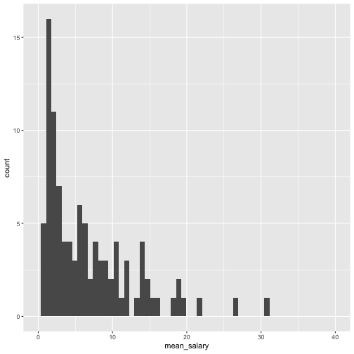
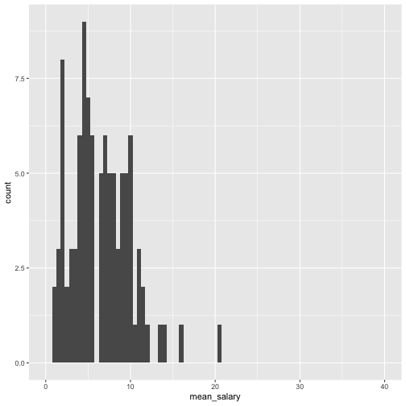

Midterm 2 Review
========================================================
author: 
date: 
autosize: true

Note to Students
========================================================

Please also consult lecture notes and your text. Many of you have been asking for sample problems. For understanding the material, textbook review exercises are great.  

Good luck studying to all!

Chapter 6
========================================================
Chapter 6 has to do with the main idea of how to get the best estimates of your population with a sample. What you need to take from both chapters most is what constitutes to a good statistical setup to get estimates you care about. Understanding where the following terms play in a study are key.   

Inference
========================================================
The process of drawing conclusions about a population based on a sample

Population vs. Sample
========================================================
The process of drawing conclusions about a population based on a sample
- **Population**: The entire group of individuals about which we want information.
- **Sample**: The part of the population for which we actually collect information. We use a sample to draw conclusions about the entire population.
- **External validity/representativeness**: Does the sample represent the population? 
Comes from your sampling design.

Observational vs. Experimental
========================================================
- **Observational**: observes individuals and measures variables of interest but does not attempt to influence the responses
- **Experimental**: deliberately imposes some treatment on individuals in order to observe their responses

Study Design
========================================================
1. **Who** belongs to the target population?
2. **How** you will take a sample of the target population?
3. What **variables** you will measure? What are the levels of each variable? How will you measure these variables?


Bias
========================================================
When the expected value based on a sample differs from the true underlying parameter value.

What does it mean to be unbiased?

Confounding variables
========================================================
- The association between an exposure and an outcome is **confounded** if there exist
one or more variables that are causes of the outcome that are also associated 
with the exposure of interest
- Only important if you want to estimate if some factor causes some outcome (no confounders in predictive or descriptive)


Chapter 7
========================================================
#### Factor
An explanatory variable that is **being manipulated**. There can be more than 1 factor.


#### Treatment
A specific **experimental condition**. When there is more than 1 factor, then the treatment is a combination of specific values of each factor.


#### Placebo effect
A response to a fake treatment because a person expects the treatment to be helpful  


Randomized comparative experiments
========================================================
- An experiment that uses both **comparison** of two or more treatments and **chance assignment** of subjects to treatments  
- **Experimental Group** (aka treated, exposed): those individuals receiving treatment  
- **Control** (aka untreated/unexposed group): those individuals not receiving treatment  
- **Placebo**: a control treatment that is fake, and meant to be indistiguishable from the treatment  
- _**Randomization!!!!**_ Individuals are assigned to treatment vs. control by chance

Experimental Design for Randomized Comparative Experiments
========================================================
1. Always have at least one **comparison group**  
2. **Randomization** to treatment  
3. Have a large enough **sample size** to reduce chance variation in the results  
4. **Blinding** (can be used on both the individual receiving the treatment and the person conducting the experiment)  

Probability
========================================================
Chapter 9 and 10 are also dense with formulas. Since you will most likely be putting these on your cheat sheet, your task is to be able to read word problems and apply the appropriate rules based on what the question is asking.

Chapter 9
========================================================
Random samples eliminate bias from the act of choosing a sample, **but they can still be wrong** 

This is because of the variability that results when we choose at random.  

If the variation when we take repeat samples from the same population is too great, we can't trust the results of any one sample.

Probablity
========================================================
- The **probability** of any outcome of a random phenomenon is the proportion of times the outcome would occur in a very long series of repetitions. (In an indefinitely long series of trials!) This is because chance behavior is unpredictable in the short run but has a regular and predictable pattern in the long run.
- We call a phenomenon **random** if individual outcomes are uncertain but there is nonetheless a regular distribution of outcomes in a large number of repetitions.


Sample Space
========================================================
- A **sample space** $S$ of a random phenomenon is a set of all possible outcomes.
- An **event** on sample space $S$ is an outcome (or a set of outcomes) of a random phenomenon. That is, an event is a subset of the sample space.

Probability Model
========================================================
A **probability model** is a math description of a random phenomenon consisting of two parts: a sample space $S$ and a way of assigning probabilities to events. 

Remember doing this in your homework?

Probability Rules
========================================================
**Rule 1.** The probability P(A) of any event satisfies $0\leq P(A)\leq 1$.  
**Rule 2.** If S is the sample space in a probability model, then P (S) = 1.  
**Rule 3.** Two events A and B are disjoint (mutually exclusive) if they have no outcomes in common and so can never occur together.   

If A and B are disjoint, $P(A U B) = P(A) + P(B)$. This is the addition rule for disjoint events.  

**Rule 4.** The Complement Rule. For any event A,

$P(A^C) = 1 - P (A)$

where $P(A^C)$ is the probability that A does not occur.

Discrete models
========================================================
A probability model with a sample space made up of a list of individual outcomes is called **discrete**.

**Example**  
e.g., Birth type: S = {vaginal, cesarian}  
e.g., Daily soda consumption: S = {0, 1, 2, 3, 4+}  

Continuous models
========================================================
The sample space is now an entire interval of numbers:  
S = {all numbers between 0 and 1}

**Example**  
e.g., Annual income: S = {0 to $\infty$}  

Density Curve
========================================================
- A **density curve** describes the overall pattern of a distribution. 
- It is always on or above the horizontal axis, and
- It has area exactly 1 underneath it.
- Of course, no set of real data is exactly described by a density curve. The curve is a model, an idealized description that is easy to use and accurate enough for practical use.
- All continuous probability models assign probability 0 to any individual outcome. *Only intervals of values have positive (non-zero) probabilities.*


Some Notation
========================================================
- the **mean** of a density curve is $\mu$ 
- the **standard deviation** of a density curve as $\sigma$
- the **sample mean** is denoted as $\bar{x}$ 

Sampling with Code
========================================================
The `sample_n` function can be used in this way. The `iris` dataset is built into `R`!


```r
library(dplyr)
sample_5    <- sample_n(iris, size = 5)
sample_5
```

```
    Sepal.Length Sepal.Width Petal.Length Petal.Width   Species
17           5.4         3.9          1.3         0.4    setosa
40           5.1         3.4          1.5         0.2    setosa
116          6.4         3.2          5.3         2.3 virginica
102          5.8         2.7          5.1         1.9 virginica
19           5.7         3.8          1.7         0.3    setosa
```


Sampling with Code
========================================================
The `sample_n` function can be used in this way. The `iris` dataset is built into `R`!

```r
sample_10  <- sample_n(iris, size = 10)
sample_10
```

```
    Sepal.Length Sepal.Width Petal.Length Petal.Width    Species
49           5.3         3.7          1.5         0.2     setosa
24           5.1         3.3          1.7         0.5     setosa
145          6.7         3.3          5.7         2.5  virginica
81           5.5         2.4          3.8         1.1 versicolor
16           5.7         4.4          1.5         0.4     setosa
13           4.8         3.0          1.4         0.1     setosa
46           4.8         3.0          1.4         0.3     setosa
104          6.3         2.9          5.6         1.8  virginica
80           5.7         2.6          3.5         1.0 versicolor
79           6.0         2.9          4.5         1.5 versicolor
```


Chapter 10
========================================================
Now, we're sliding into Chapter 10 material.

Dependence and Independence
========================================================
Two events are independent if knowing that one event occurred does not change the probability that the other occurred 

Multiplication Rule for Independent Events
========================================================
Two events A and B are independent if knowing that one occurs does not change the probability that the other occurs. If A and B are independent, 

$P(A \cap B) = P(A)\times P(B)$

Conversely, if this condition is not satisfied, then events A and B are dependent.

Conditional Probability
========================================================
When P(A) > 0, the conditional probability of B, given A, is 

$P(B|A)=\frac{P(A\&B)}{P(A)}$


General addition rule for any two events
========================================================
For any two events A and B, $P(A \cup B) = P(A) + P(B) - P(A \cap B)$. 

The probability that both of two events A and B happen together can be found by:

This formula simplifies to $P(A \cup B) = P(A) + P(B)$ when A and B are **disjoint**.

Example
========================================================
**Hearing impairment in dalmatians**
Congenital sensorineural deafness is the most common form of deafness in dogs and is often associated with congenital pigmentation deficiencies. A study of hearing impairment in dogs examined over five thousand dalmatians for both hearing impairment and iris color. ???Impaired??? was defined as deafness in either one or both ears. Dogs with one or both irises blue (a trait due to low iris pigmentation) were labeled blue.

The study found that 28% of the dalmatians were hearing impaired, 11% were blue eyed, and 5% were hearing impaired and blue eyed. 

Are these events independent?

Example
========================================================
**Solution**  
$P(I) = 0.28$  
$P(B) = 0.11$  
$P(B \cap I) = 0.05$  

Choose a dalmatian at random. Then

$P(B \cap I) = P(B) + P(I) - P(B\cap I) = 0.11 + 0.28 - 0.05 = 0.34$  

That is, 34% of dalmatians were either blue eyed or hearing impaired. A dalmatian is an unimpaired, brown-eyed dog if it is neither hearing impaired nor blue eyed. 

So, $P(Neither) = P(Unimpaired, Brown) = 1 - 0.34 = 0.66$  


*If this problem was difficult, please refer to Sarah's Venn Diagram notes on bCourses.*

General multiplication rule
========================================================
$P(A \cap B) = P(A)P(B|A)$. This is simply a rearrangement of the 
conditional probability formula.

This simplifies to $P(A \cap B) = P(A) \times P(B)$ when A and B are independent events.

Bayes' Theorem
========================================================
Bayes???s theorem states that, if a series of disjoint and complementary events A1 through Ak have nonzero probabilities, we can express the conditional probability of event Ai, knowing that event B occurred (when event B has probability not equal to 0 or 1), as

$$P(A|B) =\frac{P(B|A)P(A)}{P(B|A)P(A) + P(B|A^c)P(A^c)}$$

Distributions
========================================================
A common question has been <i><b>WHEN DO WE USE THESE DISTRIBUTIONS!?</i></b> Well, sometimes our data tell a story that we see over and over again.

We can think of distributions as things that model patterns in data. If we see data that looks approximately normal or follows a recipe for the Binomial or Poisson(*), then we should definitely consider using the appropriate distribution. When we use a distribution like one of the named three above, we can end up saying a lot about our data. We can say the mean, the variance/standard deviation, and calculate probabilities.

(*) See the following Chapter 11 and 12 notes for these recipes.

### Chapter 11: Normal Distribution
========================================================


Recipe for Normal
========================================================
1. Goals: We want to find a probability for greater or less than or greater/equal, less/equal, but NEVER exactly equal to a single number
2. The data are said to be normal or are assumed to be normal in the prompt

Question
========================================================
What is the difference between normal and standard normal?

Example
========================================================
According to <a href="https://www.basketball-reference.com/leagues/NBA_stats.html">basketball-reference.net</a>, the mean height for NBA players is 6'7" = 79 inches. Suppose it is known that player height is normally distributed with a standard deviation of 4 inches. What is the probability of a ball player to be shorter than 6 feet?

Example
========================================================
The prompt information translates to:

```r
mu  <- 79
sd  <- 4
k   <- 6*12
```

We can calculate this probability one way (without tables!).

```r
pnorm(q=k, mean=mu, sd=sd)
```

```
[1] 0.04005916
```

All the `[ ]norm` functions are fair game!

Chapter 12: Binomial and Poisson Distributions
========================================================

Binomial
========================================================
This is the formula for the Binomial distribution.

$$
P(X=k) = \Sigma_{k=0}^{n} \binom{n}{k}(p)^{k}(1-p)^{n-k}
$$

Since you'll probably have this formula on your cheat sheet, what's more important is understanding what each of the pieces of the binomial distribution function.

As we said earlier, distributions are used to calculate means, variances, and probabilities of situations we see often! Think back to the Korean drama or pop song. They have well-known structures. So does the Binomial setting. Check if your data fit the Binomial setting.

Binomial
========================================================
<u>Recipe for Binomial</u>  
1. Goals: We want to find a probability, these are all fine: $P(X>k), P(X<k), P(X \geq K), P(X \leq k), P(X=k)$  
2. You have some fixed amount of trials  
3. Trials are independent  
4. The probability of success is the same for each trial  
5. Assumption k  

Question
========================================================
When can we approximate the binomial as a normal distribution? Why?

Example
========================================================
A shopper goes online Thursday mornings to attempt to purchase Supreme apparel and accessories. Due to the brand's popularity and limited supply, the shopper successfully purchases any item 1 in 10 times. What is the probability that the shopper will make 4 successful purchases after 10 independent purchase attempts? How about greater than 4?

Example
========================================================
The prompt information translates to:

```r
n_trials    <- 10
k_success   <- 4
probability <- 1/10
```

And we can calculate the first quantity "by hand" using the formula:

```r
choose(n_trials, k_success)*(probability)^k_success*(1-probability)^(n_trials-k_success)
```

```
[1] 0.01116026
```

Example
========================================================
The prompt information translates to:

```r
n_trials    <- 10
k_success   <- 4
probability <- 1/10
```


Or we can use a special function:

```r
dbinom(x=k_success, size=n_trials, prob=probability)
```

```
[1] 0.01116026
```

Example
========================================================
The second quantity (the probability of greater than 4) can be found by using the Complement Rule.

```r
1 - choose(n_trials, 4)*(probability)^(4)*(1-probability)^(n_trials-4) - choose(n_trials, 3)*(probability)^(3)*(1-probability)^(n_trials-3) - choose(n_trials, 2)*(probability)^(2)*(1-probability)^(n_trials-2) - choose(n_trials, 1)*(probability)^(1)*(1-probability)^(n_trials-1) - choose(n_trials, 0)*(probability)^(0)*(1-probability)^(n_trials-0)
```

```
[1] 0.001634937
```

Example
========================================================
Or using another cool function that calculate the sum of probabilities from 0 to k.


```r
1-pbinom(q=k_success, size=n_trials, prob=probability)
```

```
[1] 0.001634937
```

Or even more conveniently:

```r
pbinom(q=k_success, size=n_trials, prob=probability, lower.tail=FALSE)
```

```
[1] 0.001634937
```

All the `[ ]binom` functions are fair game!

Poisson
========================================================
This is the formula for the Poisson distribution.

$$
P(X=k) = e^{-\lambda}\frac{\lambda^k}{k!}
$$

<u>Recipe for Poisson</u>  
1. Goals: We want to find a probability, these are all fine: $P(X>k), P(X<k), P(X \geq K), P(X \leq k), P(X=k)$  
2. The data are said to be normal or are assumed to be normal in the prompt  
3. Assumption 1  

Example
========================================================
San Francisco is known for its fog. In fact, the fog's name is Karl! We expect a warm, sunny, Karl-free day in San Francisco about twice per month.

**Do this at home:** What is the probability that we see more than 5 days of sun in San Francisco in a month? How about exactly 10?

Sampling Distributions
========================================================
A sampling distribution is the distribution of estimates that we have for our parameter. In our case, we either make distributions of estimates for $\mu$ or population proportion $p$.

### Chapter 13

Here's a motivating figure from the text. After you're done looking over this section, reflect on this figure and see if you can understand it all.


Law of Large Numbers
========================================================
As $n$ gets huge, our sampling distribution's mean will get closer and closer to the true population paramter value.

Law of Large Numbers
========================================================
##### Example
Let's take a look at some NBA data that was scraped off of basketball-reference.com. We'll read in the csv.


```r
western_conference <- read.csv("western_nba.csv")[,-1]
head(western_conference, 3)
```

```
             Player millions                  team
1     Stephen Curry 37.45715 Golden State Warriors
2 Russell Westbrook 35.65415 Oklahoma City Thunder
3        Chris Paul 35.65415       Houston Rockets
```

```r
mean(western_conference$millions)
```

```
[1] 6.500936
```

Law of Large Numbers
========================================================
In the following blocks, we're going to take 100 samples of size $n=2, 5, 30$. Ignore the code that you have you never learned for midterm 1. Focus on the output.


Law of Large Numbers
========================================================
###### Sampling with n=2

```r
sample_means_2 <- do.call(rbind, lapply(1:100, function(x) sample_n_salaries(2)))
sample_means_2 %>% summarize(sampling_mean=mean(mean_salary))
```

```
  sampling_mean
1      7.025869
```

Law of Large Numbers
========================================================
###### Sampling with n=5

```r
sample_means_5 <- do.call(rbind, lapply(1:100, function(x) sample_n_salaries(5)))
sample_means_5 %>% summarize(sampling_mean=mean(mean_salary))
```

```
  sampling_mean
1      5.934631
```

Law of Large Numbers
========================================================
###### Sampling with n=30

```r
sample_means_30 <- do.call(rbind, lapply(1:100, function(x) sample_n_salaries(30)))
sample_means_30 %>% summarize(sampling_mean=mean(mean_salary))
```

```
  sampling_mean
1      6.318916
```

Central Limit Theorem
========================================================
As $n$ gets huge, our sampling distribution itself will look more and more like a normal distribution.

Central Limit Theorem
========================================================
##### Example
Recall the data from earlier.


```r
head(western_conference, 10)
```

```
              Player millions                   team
1      Stephen Curry 37.45715  Golden State Warriors
2  Russell Westbrook 35.65415  Oklahoma City Thunder
3         Chris Paul 35.65415        Houston Rockets
4       LeBron James 35.65415     Los Angeles Lakers
5        Paul George 30.56070  Oklahoma City Thunder
6        Mike Conley 30.52112      Memphis Grizzlies
7       James Harden 30.43185        Houston Rockets
8       Kevin Durant 30.00000  Golden State Warriors
9       Paul Millsap 29.73077         Denver Nuggets
10    Damian Lillard 27.97769 Portland Trail Blazers
```

Central Limit Theorem
========================================================
###### Exploring the Population ("The Underlying Distribution")
This is the distribution of the population salaries.


What is the mean parameter $\mu$ of the population? We can calculate this by hand or by a function. Focus on the by hand calculation. 

Here's the "by hand" calculation. The following functions may seem new to you, but think intuitively instead of code-wise. We have a data on all of the salaries, then we add all the salaries up, then divide by the number of salaries we have to get the average.


```r
vector_of_salaries <- western_conference$millions
sum(vector_of_salaries) / length(vector_of_salaries)
```

```
[1] 6.500936
```

Here's the `dplyr` solution.


```r
library(dplyr)
western_conference %>% summarize(mu=mean(vector_of_salaries))
```

```
        mu
1 6.500936
```

Let's see what our sample distribution looks like for several choices of $n$.

Central Limit Theorem
========================================================
###### Sampling with n=2

```r
ggplot(sample_means_2, aes(x=mean_salary)) + geom_histogram(binwidth=0.2)
```



Central Limit Theorem
========================================================
###### Sampling with n=5

```r
ggplot(sample_means_5, aes(x=mean_salary)) + geom_histogram(binwidth=0.2)
```



Central Limit Theorem
========================================================
###### Sampling with n=30
Visually, the sample size of $n=30$ is the most symmetric.


```r
ggplot(sample_means_30, aes(x=mean_salary)) + geom_histogram(binwidth=0.1)
```


As $n$ gets larger, then we see the sampling distribution get less skewed and more like the normal curve.

Sampling Distribution Means and Variances
========================================================
Sampling distributions have means and variances that can be calculated as specified below!


```
             mean   variance
counts      x-bar sd/sqrt(n)
proportions     p (p(1-p))/n
```

**Question:** What is the relationship between variance and standard deviation?

**Question for Home:** What assumptions go along with sampling distributions and their normalities? Check the chapter.

Some Questions
========================================================
- What assumptions do we need to assume normality for the proportions row?  
- What is a parameter? What is a statistic?  
